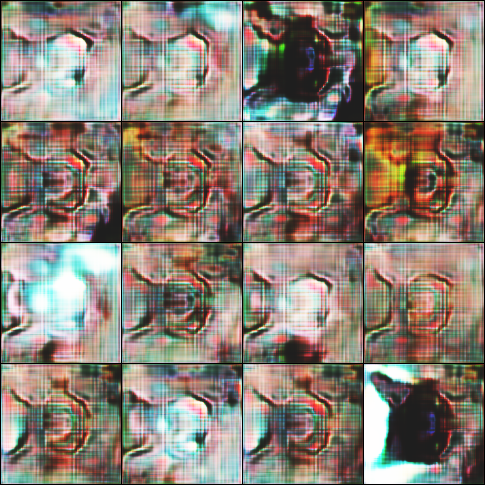
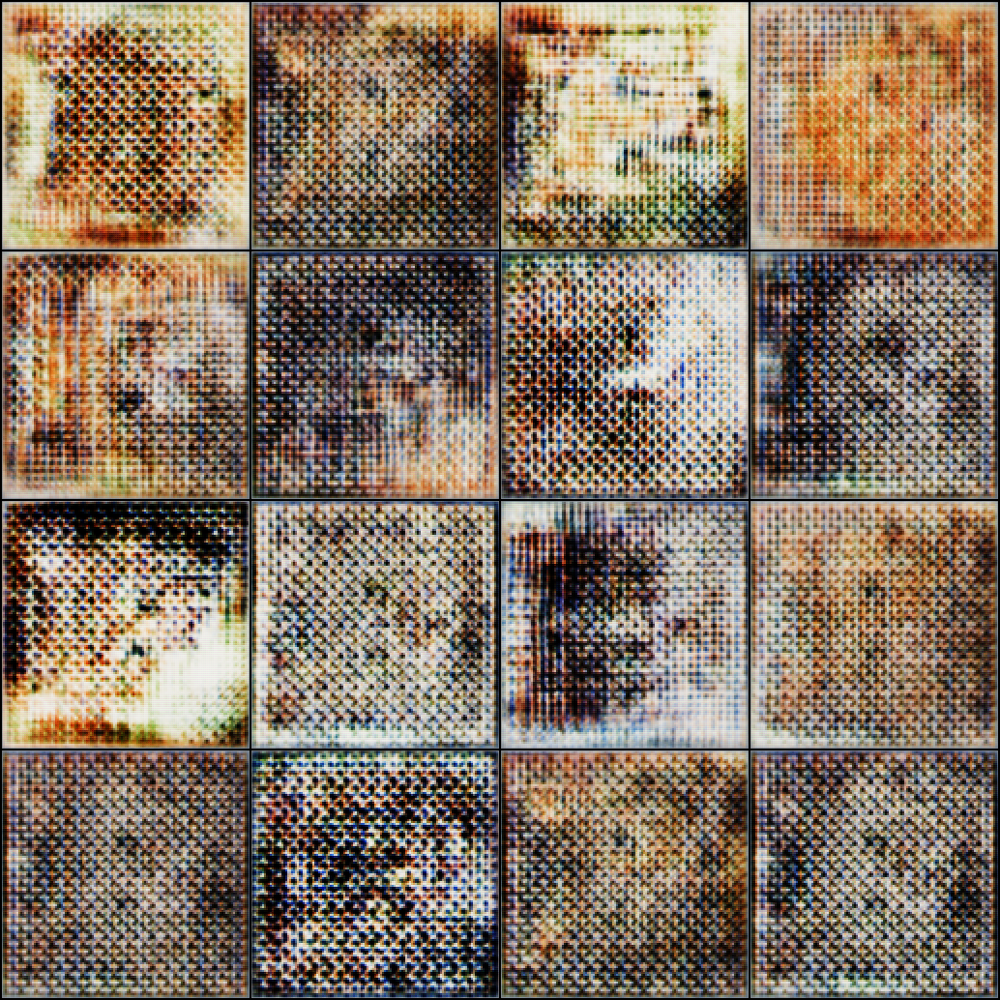
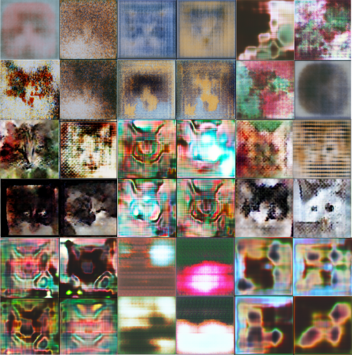

# Cars Generator
**DCGAN, WHAN-GP, RAGAN, SAGAN, StyleGAN, ...**

(polishing & uploading old project + learning a bunch of new things about GANs)

cars come in multiple colors, shapes and attitutes
we have white, black (zoomies included) and god forbid oranges
some combinations include cows, tuxedos and 
the sure thing is they make our FYPs much more intertaining
the aim of this project is to create more of'em 

# Cool findings
<table>
  <tr>
    <td align="center">
       
      interpolation upsampling RAGAN Generated images mid training   
    </td>
    <td align="center">
       
      DeConv upsampling RAGAN Generated images mid training   
    </td>
  </tr>
</table>

# Samples
**(exploiting kaggle until someone gift me a cluster to practive DDP and spend a couple of months building an on the fly optimization framework for parallel experimentations)**
### Base Model
(demons that look like cats when u squint your eyes)

   
  <em>selected samples from different models and configs at varying training phases</em>

## Optimization
#### Data pipeline: Loading + Augmentation 3x speedup (minima optimization for both)

in the `data-optimization branch` I switched from the conventional `open-cv`, `albumentation` and `pytorch`'s DataLoaders
to `Nvidia-dali`: data loading (nvidia never failed to amaze me) and `Kornia` augmentation on device a tresure I found

#### concurrent computation of losses and penalties (when possible :'))
*(experiemnts with cuda streams wheren't robust (depending on torch.compile) thus only used in optimization experiementations :'( )*

 

   
  <em>admire the stars morty (none atm)</em>

