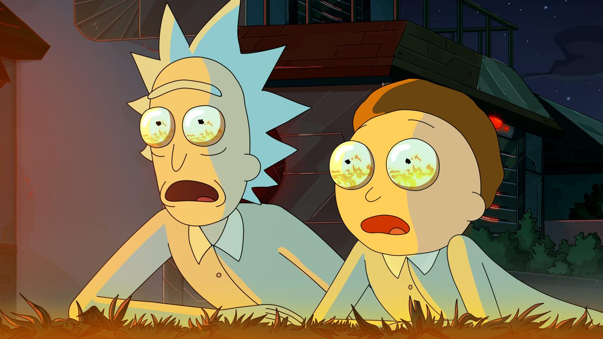
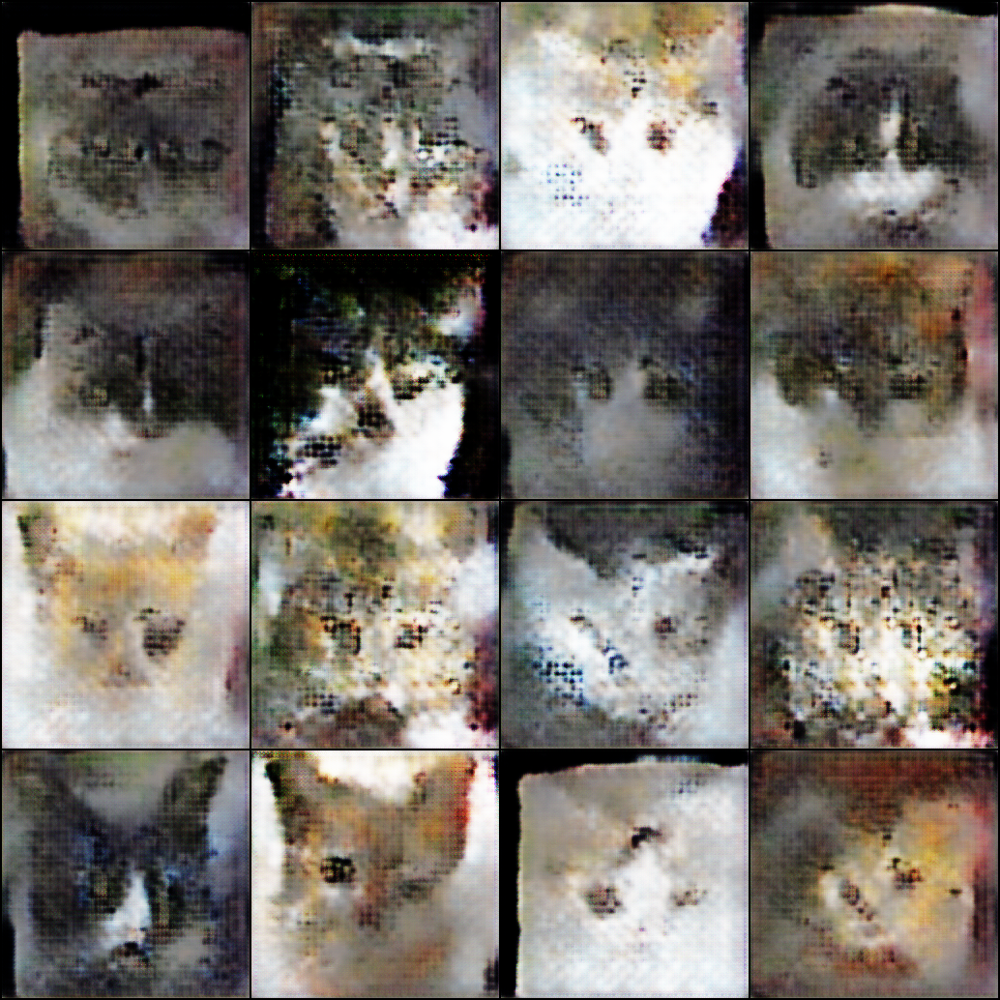

# Cars Generator

(polishing & uploading old project + learning a bunch of new things about GANs)

cars come in multiple colors, shapes and attitutes
we have white, black (zoomies included) and god forbid oranges
some combinations include cows, tuxedos and 
the sure thing is they make our FYPs much more intertaining
the aim of this project is to create more of'em 

<p align="center">
  <br>
  <em>admire the stars morty (none atm)</em>
</p>


### Base Model
(demons that look like cats when u squint your eyes)
<p align="center">
  <br>
  <em>base model samples</em>
</p>
```bash
python train.py training.epochs=160 optimizer.D_lr=8e-5 optimizer.G_lr=12e-5
```
